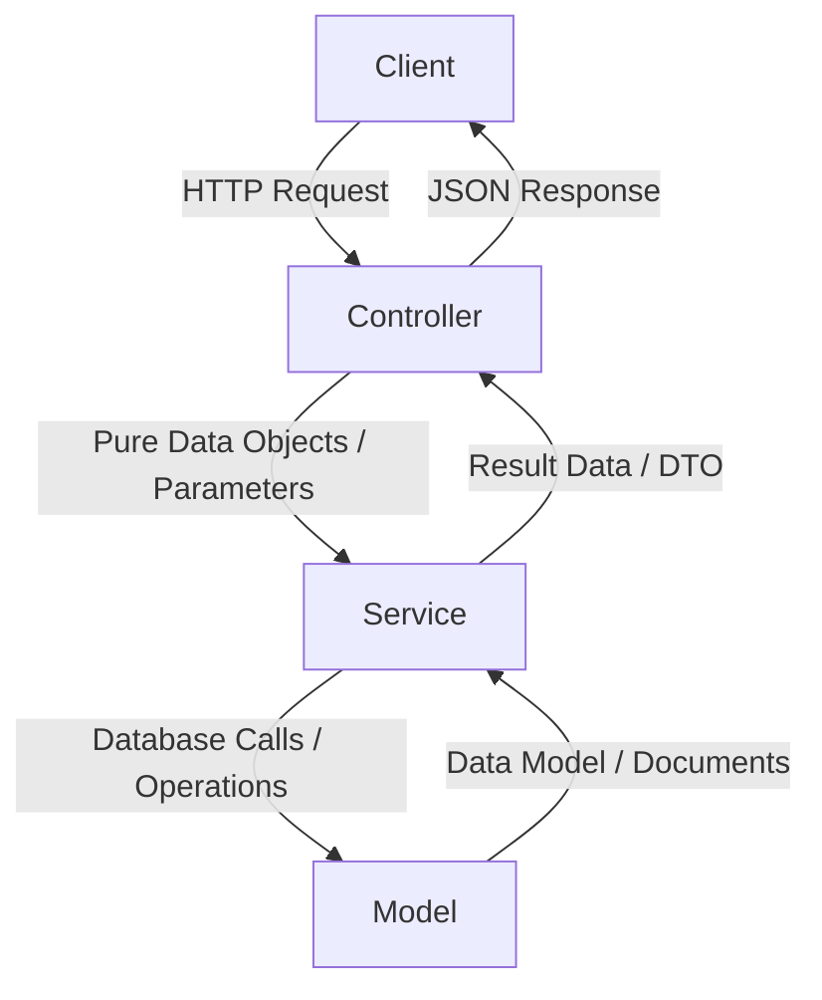

# Clean Architecture and Separation of Concerns

## 1. Controller-Service-Model (CSM) Architecture
- **Strict Separation of Concerns**: Enforce a strict three-tier architecture: Controllers, Services, and Models. Under no circumstances should database queries be executed in controllers, nor should HTTP-specific parameters (like `req`, `res`, `next`) be passed down to services or models.

---

## 2. Controllers Layer
- **Role**: Entry point for HTTP requests.
- **Rules**:
  - Direct parameter extraction: Parse and extract route parameters, query parameters, headers, and request bodies.
  - Validation: Perform basic structural validation of incoming payloads (using validators like Joi, Zod, or custom middleware) before passing them to the services.
  - No Business Logic: Do not write logic related to business domain rules, external integrations, or data processing inside controllers.
  - No Database Queries: Never invoke Mongoose models or queries directly inside a controller.
  - HTTP Response: Construct standard HTTP responses using appropriate status codes (e.g., 200 OK, 201 Created, 400 Bad Request) and send the serialized payload back to the client.

## 3. Services Layer
- **Role**: Encapsulation of domain and business logic.
- **Rules**:
  - Pure JavaScript/TypeScript Functions: Services must be class methods or functions that take plain TypeScript types/interfaces and return plain TypeScript types/interfaces or promises.
  - Framework Agnostic: Services must not import or depend on Express types (`Request`, `Response`). They should be fully testable without launching an HTTP server.
  - Data Orchestration: Coordinate calls to database models, perform calculations, format/manipulate data, and interface with third-party service abstractions (e.g., email dispatch, external APIs).

## 4. Models Layer
- **Role**: Database interactions and schema definitions.
- **Rules**:
  - Schema Definitions: Define schema structures, validations, indexes, and plugins.
  - Data Constraints: Enforce data constraints (e.g., uniqueness, default values, references).
  - Encapsulate Queries: Define static methods, query helpers, and document methods within the model file for complex queries. Avoid writing ad-hoc complex Mongoose queries inside services; instead, delegate them to Model methods.
